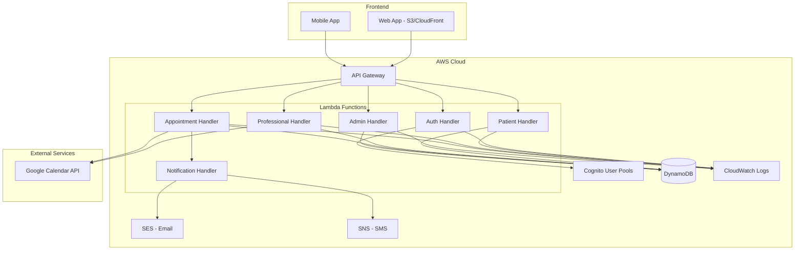

# Design Document - Plataforma de Agendamento Médico

## Overview

O Remarca é uma plataforma SaaS serverless construída na AWS para gerenciamento de consultas médicas. O sistema utiliza arquitetura serverless com API Gateway + Lambda para backend, DynamoDB para persistência, Cognito para autenticação, e integrações com Google Calendar API e AWS SES para notificações.

A arquitetura é multi-tenant, isolando dados por clínica/profissional, e suporta três tipos de usuários: Administrador, Profissional e Paciente. O design prioriza baixo custo operacional (orçamento inicial de $10/mês), escalabilidade automática e conformidade com LGPD.

## Architecture

### High-Level Architecture



### Technology Stack

- **Frontend**: React/Next.js hospedado em S3 + CloudFront
- **Backend**: Node.js 18.x em AWS Lambda
- **API**: REST via API Gateway (HTTP API para menor custo)
- **Database**: DynamoDB (single-table design para otimização de custos)
- **Authentication**: AWS Cognito User Pools
- **Email**: AWS SES (Simple Email Service)
- **SMS**: AWS SNS (opcional, para notificações futuras)
- **Logging**: CloudWatch Logs
- **External Integration**: Google Calendar API v3

### Deployment Strategy

- Infrastructure as Code: AWS SAM ou Serverless Framework
- CI/CD: GitHub Actions
- Environments: dev, staging, production
- Custo estimado: $10/mês (100 pacientes, 3 profissionais, ~1000 requisições/mês)

## Components and Interfaces

### 1. Authentication Service

**Responsabilidade**: Gerenciar autenticação e autorização de usuários.

**Interface**:
```typescript
interface AuthService {
  // Registrar novo usuário
  register(email: string, password: string, userType: UserType): Promise<User>
  
  // Login de usuário
  login(email: string, password: string): Promise<AuthToken>
  
  // Validar token JWT
  validateToken(token: string): Promise<TokenPayload>
  
  // Verificar permissões
  hasPermission(userId: string, resource: string, action: string): Promise<boolean>
}

type UserType = 'ADMIN' | 'PROFESSIONAL' | 'PATIENT'

interface AuthToken {
  accessToken: string
  refreshToken: string
  expiresIn: number
}

interface TokenPayload {
  userId: string
  tenantId: string
  userType: UserType
  email: string
}
```

**Implementação**: Lambda function integrada com Cognito User Pools.

### 2. Patient Service

**Responsabilidade**: Gerenciar cadastro e dados de pacientes.

**Interface**:
```typescript
interface PatientService {
  // Criar paciente
  createPatient(data: CreatePatientInput): Promise<Patient>
  
  // Buscar paciente por ID
  getPatient(patientId: string, tenantId: string): Promise<Patient>
  
  // Atualizar dados do paciente
  updatePatient(patientId: string, data: UpdatePatientInput): Promise<Patient>
  
  // Listar pacientes (admin/profissional)
  listPatients(tenantId: string, filters?: PatientFilters): Promise<Patient[]>
  
  // Deletar dados do paciente (LGPD)
  deletePatient(patientId: string, tenantId: string): Promise<void>
}

interface CreatePatientInput {
  name: string
  email: string
  phone: string
  tenantId: string
}

interface Patient {
  patientId: string
  tenantId: string
  name: string
  email: string
  phone: string
  createdAt: string
  updatedAt: string
}
```

### 3. Professional Service

**Responsabilidade**: Gerenciar profissionais e suas configurações.

**Interface**:
```typescript
interface ProfessionalService {
  // Criar profissional
  createProfessional(data: CreateProfessionalInput): Promise<Professional>
  
  // Buscar profissional
  getProfessional(professionalId: string): Promise<Professional>
  
  // Atualizar profissional
  updateProfessional(professionalId: string, data: UpdateProfessionalInput): Promise<Professional>
  
  // Configurar disponibilidade
  setAvailability(professionalId: string, availability: Availability): Promise<void>
  
  // Buscar disponibilidade
  getAvailability(professionalId: string): Promise<Availability>
}

interface Professional {
  professionalId: string
  tenantId: string
  name: string
  email: string
  specialty: string
  googleCalendarToken?: string
  createdAt: string
  updatedAt: string
}

interface Availability {
  professionalId: string
  schedule: WeeklySchedule
}

interface WeeklySchedule {
  monday?: DaySchedule
  tuesday?: DaySchedule
  wednesday?: DaySchedule
  thursday?: DaySchedule
  friday?: DaySchedule
  saturday?: DaySchedule
  sunday?: DaySchedule
}

interface DaySchedule {
  enabled: boolean
  slots: TimeSlot[]
}

interface TimeSlot {
  startTime: string  // HH:mm format
  endTime: string    // HH:mm format
}
```

### 4. Product Service

**Responsabilidade**: Gerenciar produtos (tipos de consulta).

**Interface**:
```typescript
interface ProductService {
  // Criar produto
  createProduct(data: CreateProductInput): Promise<Product>
  
  // Buscar produto
  getProduct(productId: string, tenantId: string): Promise<Product>
  
  // Listar produtos do profissional
  listProducts(tenantId: string, professionalId?: string): Promise<Product[]>
  
  // Atualizar produto
  updateProduct(productId: string, data: UpdateProductInput): Promise<Product>
  
  // Desativar produto
  deactivateProduct(productId: string, tenantId: string): Promise<void>
}

interface Product {
  productId: string
  tenantId: string
  professionalId: string
  name: string
  description: string
  durationMinutes: number
  active: boolean
  createdAt: string
  updatedAt: string
}
```

### 5. Appointment Service

**Responsabilidade**: Gerenciar agendamentos, reagendamentos e cancelamentos.

**Interface**:
```typescript
interface AppointmentService {
  // Criar agendamento
  createAppointment(data: CreateAppointmentInput): Promise<Appointment>
  
  // Buscar agendamento
  getAppointment(appointmentId: string, tenantId: string): Promise<Appointment>
  
  // Listar agendamentos
  listAppointments(tenantId: string, filters: AppointmentFilters): Promise<Appointment[]>
  
  // Reagendar
  rescheduleAppointment(appointmentId: string, newDateTime: string): Promise<Appointment>
  
  // Cancelar
  cancelAppointment(appointmentId: string, cancelledBy: string): Promise<Appointment>
  
  // Cancelamento em lote (profissional)
  bulkCancelAppointments(appointmentIds: string[], tenantId: string): Promise<BulkResult>
  
  // Reagendamento em lote (profissional)
  bulkRescheduleAppointments(updates: BulkRescheduleInput[]): Promise<BulkResult>
}

interface Appointment {
  appointmentId: string
  tenantId: string
  patientId: string
  professionalId: string
  productId: string
  dateTime: string  // ISO 8601
  status: AppointmentStatus
  googleCalendarEventId?: string
  createdAt: string
  updatedAt: string
  cancelledAt?: string
  cancelledBy?: string
}

type AppointmentStatus = 'SCHEDULED' | 'CANCELLED' | 'COMPLETED'

interface BulkResult {
  successful: string[]
  failed: Array<{ id: string; error: string }>
}
```

### 6. Availability Service

**Responsabilidade**: Calcular slots disponíveis considerando agenda, consultas e Google Calendar.

**Interface**:
```typescript
interface AvailabilityService {
  // Buscar slots disponíveis
  getAvailableSlots(request: AvailabilityRequest): Promise<AvailableSlot[]>
  
  // Verificar se slot está disponível
  isSlotAvailable(professionalId: string, dateTime: string, durationMinutes: number): Promise<boolean>
  
  // Reservar slot (transacional)
  reserveSlot(professionalId: string, dateTime: string, durationMinutes: number): Promise<SlotReservation>
}

interface AvailabilityRequest {
  professionalId: string
  productId: string
  startDate: string  // YYYY-MM-DD
  endDate: string    // YYYY-MM-DD
}

interface AvailableSlot {
  dateTime: string  // ISO 8601
  available: boolean
}

interface SlotReservation {
  reservationId: string
  expiresAt: string
}
```

### 7. Google Calendar Integration Service

**Responsabilidade**: Sincronizar eventos com Google Calendar.

**Interface**:
```typescript
interface GoogleCalendarService {
  // Autorizar acesso ao Google Calendar
  authorizeCalendar(professionalId: string, authCode: string): Promise<void>
  
  // Criar evento
  createEvent(professionalId: string, appointment: Appointment): Promise<string>
  
  // Atualizar evento
  updateEvent(professionalId: string, eventId: string, appointment: Appointment): Promise<void>
  
  // Deletar evento
  deleteEvent(professionalId: string, eventId: string): Promise<void>
  
  // Buscar eventos (para detectar conflitos)
  getEvents(professionalId: string, startDate: string, endDate: string): Promise<CalendarEvent[]>
}

interface CalendarEvent {
  id: string
  summary: string
  start: string
  end: string
}
```

### 8. Notification Service

**Responsabilidade**: Enviar notificações por email e SMS.

**Interface**:
```typescript
interface NotificationService {
  // Enviar email
  sendEmail(to: string, template: EmailTemplate, data: any): Promise<void>
  
  // Enviar SMS (futuro)
  sendSMS(to: string, message: string): Promise<void>
  
  // Notificar criação de agendamento
  notifyAppointmentCreated(appointment: Appointment): Promise<void>
  
  // Notificar reagendamento
  notifyAppointmentRescheduled(appointment: Appointment, oldDateTime: string): Promise<void>
  
  // Notificar cancelamento
  notifyAppointmentCancelled(appointment: Appointment): Promise<void>
}

type EmailTemplate = 
  | 'APPOINTMENT_CREATED'
  | 'APPOINTMENT_RESCHEDULED'
  | 'APPOINTMENT_CANCELLED'
  | 'APPOINTMENT_REMINDER'
  | 'WELCOME_PATIENT'
```

### 9. Subscription Service (Admin)

**Responsabilidade**: Gerenciar assinaturas de profissionais.

**Interface**:
```typescript
interface SubscriptionService {
  // Criar assinatura
  createSubscription(data: CreateSubscriptionInput): Promise<Subscription>
  
  // Buscar assinatura
  getSubscription(subscriptionId: string): Promise<Subscription>
  
  // Atualizar status
  updateSubscriptionStatus(subscriptionId: string, status: SubscriptionStatus): Promise<Subscription>
  
  // Verificar se assinatura está ativa
  isSubscriptionActive(tenantId: string): Promise<boolean>
  
  // Listar assinaturas
  listSubscriptions(filters?: SubscriptionFilters): Promise<Subscription[]>
}

interface Subscription {
  subscriptionId: string
  tenantId: string
  professionalId: string
  status: SubscriptionStatus
  startDate: string
  endDate?: string
  plan: string
  createdAt: string
  updatedAt: string
}

type SubscriptionStatus = 'ACTIVE' | 'SUSPENDED' | 'CANCELLED' | 'EXPIRED'
```

## Data Models

### DynamoDB Single-Table Design

Para otimizar custos, utilizaremos single-table design no DynamoDB com os seguintes padrões de chave:

```
Table: remarca-main

Primary Key:
- PK (Partition Key): String
- SK (Sort Key): String

GSI1:
- GSI1PK: String
- GSI1SK: String

GSI2:
- GSI2PK: String
- GSI2SK: String
```

### Entity Patterns

#### User (Cognito + DynamoDB)
```
PK: USER#<userId>
SK: PROFILE
Attributes: {
  userId, tenantId, email, name, phone, userType,
  createdAt, updatedAt
}

GSI1PK: TENANT#<tenantId>
GSI1SK: USER#<userId>
```

#### Professional
```
PK: TENANT#<tenantId>
SK: PROFESSIONAL#<professionalId>
Attributes: {
  professionalId, name, email, specialty,
  googleCalendarToken (encrypted), createdAt, updatedAt
}

GSI1PK: PROFESSIONAL#<professionalId>
GSI1SK: METADATA
```

#### Patient
```
PK: TENANT#<tenantId>
SK: PATIENT#<patientId>
Attributes: {
  patientId, name, email (encrypted), phone (encrypted),
  createdAt, updatedAt
}

GSI1PK: PATIENT#<patientId>
GSI1SK: METADATA
```

#### Product
```
PK: TENANT#<tenantId>
SK: PRODUCT#<productId>
Attributes: {
  productId, professionalId, name, description,
  durationMinutes, active, createdAt, updatedAt
}

GSI1PK: PROFESSIONAL#<professionalId>
GSI1SK: PRODUCT#<productId>
```

#### Availability
```
PK: PROFESSIONAL#<professionalId>
SK: AVAILABILITY
Attributes: {
  professionalId, schedule: {
    monday: { enabled, slots: [{startTime, endTime}] },
    tuesday: { ... },
    ...
  },
  updatedAt
}
```

#### Appointment
```
PK: TENANT#<tenantId>
SK: APPOINTMENT#<appointmentId>
Attributes: {
  appointmentId, patientId, professionalId, productId,
  dateTime, status, googleCalendarEventId,
  createdAt, updatedAt, cancelledAt, cancelledBy
}

GSI1PK: PATIENT#<patientId>
GSI1SK: APPOINTMENT#<dateTime>

GSI2PK: PROFESSIONAL#<professionalId>
GSI2SK: APPOINTMENT#<dateTime>
```

#### Subscription
```
PK: TENANT#<tenantId>
SK: SUBSCRIPTION
Attributes: {
  subscriptionId, professionalId, status,
  startDate, endDate, plan, createdAt, updatedAt
}

GSI1PK: SUBSCRIPTION#<subscriptionId>
GSI1SK: METADATA
```

### Data Encryption

- **At Rest**: DynamoDB encryption habilitada
- **In Transit**: HTTPS obrigatório via API Gateway
- **Sensitive Fields**: Email e telefone criptografados usando AWS KMS
- **Tokens**: Google Calendar tokens armazenados criptografados

## Correctness Properties

*Uma propriedade é uma característica ou comportamento que deve ser verdadeiro em todas as execuções válidas de um sistema - essencialmente, uma declaração formal sobre o que o sistema deve fazer. Propriedades servem como ponte entre especificações legíveis por humanos e garantias de corretude verificáveis por máquina.*

Antes de definir as propriedades, vou realizar a análise de testabilidade dos critérios de aceitação:


### Reflexão sobre Propriedades

Após análise dos critérios de aceitação, identifiquei as seguintes consolidações para eliminar redundâncias:

**Consolidações de Propriedades:**

1. **Notificações**: Critérios 6.3, 7.3, 8.3, 9.3, 10.3 e 11.1 todos testam envio de emails em operações de consulta. Consolidar em uma propriedade geral de notificações.

2. **Liberação de Slots**: Critérios 7.2, 8.2, 9.2, 10.2 todos testam que slots são liberados após cancelamento/reagendamento. Consolidar em uma propriedade de gerenciamento de slots.

3. **Sincronização Google Calendar**: Critérios 4.2, 4.3, 4.4, 7.5, 9.5, 10.5 testam sincronização bidirecional. Consolidar em propriedades de round-trip.

4. **Isolamento Multi-tenant**: Critérios 2.5, 3.2, 3.3, 12.1, 12.2, 12.3, 12.4 testam isolamento de dados. Consolidar em propriedades gerais de multi-tenancy.

5. **Validação de Disponibilidade**: Critérios 5.2, 5.3, 5.4, 5.5, 6.5, 17.2 testam que slots respeitam disponibilidade. Consolidar em uma propriedade de cálculo de disponibilidade.

6. **Prevenção de Conflitos**: Critérios 6.4, 7.4, 14.1, 14.3, 14.4, 14.5 testam prevenção de overbooking. Consolidar em propriedades de atomicidade.

7. **Filtros e Ordenação**: Critérios 17.3, 17.4, 18.3, 18.4, 18.5 testam filtros e ordenação. Consolidar em propriedades de query.

8. **Validação de Entrada**: Critérios 2.4, 19.1, 19.2, 19.3, 19.4, 19.5 testam validação. Consolidar em propriedades gerais de validação.

### Propriedades de Corretude

#### Propriedade 1: Autenticação Round-Trip
*Para qualquer* usuário com credenciais válidas, autenticar e então validar o token retornado deve extrair corretamente o userId, tenantId e userType originais.
**Valida: Requisitos 1.1, 1.2**

#### Propriedade 2: Isolamento de Permissões
*Para qualquer* usuário e recurso onde o usuário não tem permissão, tentar acessar o recurso deve retornar erro 403 e não expor dados.
**Valida: Requisitos 1.4, 1.5**

#### Propriedade 3: Unicidade de Email
*Para qualquer* email já cadastrado no sistema, tentar cadastrar um novo usuário com o mesmo email deve falhar com erro de duplicação.
**Valida: Requisitos 2.2**

#### Propriedade 4: Validação de Formato de Dados
*Para qualquer* entrada com formato inválido de email, telefone ou data, o sistema deve rejeitar com erro 400 e mensagem descritiva.
**Valida: Requisitos 2.4, 19.3**

#### Propriedade 5: Isolamento Multi-tenant
*Para qualquer* query de dados (pacientes, produtos, consultas), o sistema deve retornar apenas registros do tenant do usuário autenticado, nunca de outros tenants.
**Valida: Requisitos 2.5, 3.2, 3.3, 12.2, 12.4, 18.2**

#### Propriedade 6: Associação de Tenant em Criação
*Para qualquer* entidade criada (paciente, profissional, produto, consulta), o registro deve conter o tenantId correto e ser recuperável apenas por usuários daquele tenant.
**Valida: Requisitos 12.1, 12.3**

#### Propriedade 7: Validação de Duração de Produto
*Para qualquer* tentativa de criar produto com duração menor ou igual a zero, o sistema deve rejeitar com erro de validação.
**Valida: Requisitos 3.4**

#### Propriedade 8: Soft Delete de Produto
*Para qualquer* produto desativado, ele deve permanecer no banco de dados com flag active=false e não aparecer em listagens de produtos ativos.
**Valida: Requisitos 3.5**

#### Propriedade 9: Sincronização Google Calendar - Round Trip
*Para qualquer* consulta criada no sistema, deve existir um evento correspondente no Google Calendar, e cancelar a consulta deve remover o evento.
**Valida: Requisitos 4.2, 4.3, 8.5, 10.5**

#### Propriedade 10: Atualização de Evento no Google Calendar
*Para qualquer* consulta remarcada, o evento no Google Calendar deve ser atualizado com a nova data/hora, mantendo o mesmo eventId.
**Valida: Requisitos 4.4, 7.5, 9.5**

#### Propriedade 11: Detecção de Conflitos com Google Calendar
*Para qualquer* horário que possui evento no Google Calendar do profissional, esse horário não deve aparecer na lista de slots disponíveis.
**Valida: Requisitos 4.5, 5.5**

#### Propriedade 12: Slots Dentro da Disponibilidade Configurada
*Para qualquer* busca de slots disponíveis, todos os slots retornados devem estar dentro dos horários de trabalho configurados pelo profissional.
**Valida: Requisitos 5.2, 6.5**

#### Propriedade 13: Exclusão de Slots Ocupados
*Para qualquer* slot que possui consulta agendada, esse slot não deve aparecer na lista de slots disponíveis.
**Valida: Requisitos 5.3, 14.3**

#### Propriedade 14: Duração de Slots Baseada em Produto
*Para qualquer* produto com duração D minutos, os slots disponíveis calculados devem ter exatamente D minutos de duração.
**Valida: Requisitos 5.4, 17.5**

#### Propriedade 15: Criação de Consulta Ocupa Slot
*Para qualquer* consulta criada com sucesso, o slot correspondente deve imediatamente ficar indisponível para novos agendamentos.
**Valida: Requisitos 6.2**

#### Propriedade 16: Notificações em Operações de Consulta
*Para qualquer* operação de criação, reagendamento ou cancelamento de consulta, emails devem ser enviados para todos os usuários envolvidos (paciente e profissional).
**Valida: Requisitos 6.3, 7.3, 8.3, 9.3, 10.3, 11.1**

#### Propriedade 17: Prevenção de Overbooking
*Para qualquer* tentativa de agendar em slot já ocupado, o sistema deve retornar erro de conflito e não criar a consulta.
**Valida: Requisitos 6.4, 7.4, 14.5**

#### Propriedade 18: Atomicidade em Agendamento Concorrente
*Para quaisquer* duas tentativas simultâneas de agendar o mesmo slot, apenas uma deve ter sucesso e a outra deve receber erro de conflito.
**Valida: Requisitos 14.1**

#### Propriedade 19: Liberação de Slot em Reagendamento
*Para qualquer* consulta remarcada, o slot anterior deve ficar disponível e o novo slot deve ficar ocupado.
**Valida: Requisitos 7.2, 9.2**

#### Propriedade 20: Liberação de Slot em Cancelamento
*Para qualquer* consulta cancelada, o slot deve imediatamente ficar disponível para novos agendamentos.
**Valida: Requisitos 8.2, 10.2**

#### Propriedade 21: Persistência de Histórico de Cancelamentos
*Para qualquer* consulta cancelada, ela deve permanecer no banco de dados com status CANCELLED e ser incluída em consultas de histórico.
**Valida: Requisitos 8.4**

#### Propriedade 22: Operações em Lote - Reagendamento
*Para qualquer* conjunto de consultas válidas, reagendamento em lote deve atualizar todas as consultas e seus eventos no Google Calendar.
**Valida: Requisitos 9.4, 9.5**

#### Propriedade 23: Operações em Lote - Cancelamento
*Para qualquer* conjunto de consultas válidas, cancelamento em lote deve marcar todas como canceladas e remover todos os eventos do Google Calendar.
**Valida: Requisitos 10.4, 10.5**

#### Propriedade 24: Resiliência de Notificações
*Para qualquer* falha no envio de email, a operação principal (criar/remarcar/cancelar consulta) deve ser completada com sucesso e o erro deve ser apenas logado.
**Valida: Requisitos 11.3**

#### Propriedade 25: Conteúdo de Notificações
*Para qualquer* email de notificação enviado, o conteúdo deve incluir todos os detalhes da consulta (data, hora, profissional, paciente, produto).
**Valida: Requisitos 11.4**

#### Propriedade 26: Criação de Assinatura Ativa
*Para qualquer* assinatura criada por administrador, ela deve ter status ACTIVE e estar associada a um profissional e tenant específicos.
**Valida: Requisitos 13.1, 13.2**

#### Propriedade 27: Bloqueio por Assinatura Expirada
*Para qualquer* profissional com assinatura expirada, tentativas de acessar funcionalidades do sistema devem ser bloqueadas com erro apropriado.
**Valida: Requisitos 13.3**

#### Propriedade 28: Histórico de Mudanças de Assinatura
*Para qualquer* mudança de status de assinatura (ativar, desativar, renovar), um registro de histórico deve ser criado com timestamp e status anterior/novo.
**Valida: Requisitos 13.5**

#### Propriedade 29: Criptografia de Dados Sensíveis
*Para qualquer* dado sensível armazenado (email, telefone), ele deve estar criptografado no DynamoDB e ser descriptografado apenas quando acessado por usuário autorizado.
**Valida: Requisitos 15.1**

#### Propriedade 30: Exclusão de Dados LGPD
*Para qualquer* solicitação de exclusão de dados por paciente, todos os dados pessoais devem ser removidos do DynamoDB e não mais recuperáveis.
**Valida: Requisitos 15.3**

#### Propriedade 31: Auditoria de Acesso a Dados Pessoais
*Para qualquer* acesso a dados pessoais de paciente, um log deve ser criado no CloudWatch contendo userId, timestamp e tipo de operação.
**Valida: Requisitos 15.4**

#### Propriedade 32: Exportação de Dados LGPD
*Para qualquer* usuário, a exportação de dados pessoais deve retornar todos os seus dados em formato JSON legível.
**Valida: Requisitos 15.5**

#### Propriedade 33: Respostas em JSON Válido
*Para qualquer* resposta da API, o conteúdo deve ser JSON válido e parseável.
**Valida: Requisitos 16.2**

#### Propriedade 34: Códigos HTTP Apropriados
*Para qualquer* operação bem-sucedida, o código HTTP deve ser 200/201, para erros de validação 400, para não autorizado 401, para proibido 403, para não encontrado 404, e para erros internos 500.
**Valida: Requisitos 16.3, 20.1**

#### Propriedade 35: Validação de Payload com Erros Descritivos
*Para qualquer* payload inválido (campos faltando, tipos errados), o sistema deve retornar erro 400 com mensagem descritiva indicando o problema específico.
**Valida: Requisitos 16.4, 19.1, 19.2**

#### Propriedade 36: Filtro de Data em Busca de Slots
*Para qualquer* busca de slots com filtro de data inicial e final, todos os slots retornados devem estar dentro do período especificado.
**Valida: Requisitos 17.3**

#### Propriedade 37: Ordenação Cronológica de Slots
*Para qualquer* lista de slots disponíveis retornada, os slots devem estar ordenados cronologicamente (do mais próximo ao mais distante).
**Valida: Requisitos 17.4**

#### Propriedade 38: Completude de Histórico de Consultas
*Para qualquer* paciente, buscar histórico deve retornar todas as suas consultas (agendadas, canceladas, concluídas), sem omissões.
**Valida: Requisitos 18.1**

#### Propriedade 39: Filtro de Status em Histórico
*Para qualquer* busca de histórico com filtro de status, apenas consultas com aquele status específico devem ser retornadas.
**Valida: Requisitos 18.3**

#### Propriedade 40: Filtro de Período em Histórico
*Para qualquer* busca de histórico com filtro de período, apenas consultas com data dentro do período devem ser retornadas.
**Valida: Requisitos 18.4**

#### Propriedade 41: Ordenação de Histórico
*Para qualquer* histórico de consultas retornado, as consultas devem estar ordenadas por data (mais recentes primeiro ou mais antigas primeiro, conforme especificado).
**Valida: Requisitos 18.5**

#### Propriedade 42: Validação de Datas Futuras
*Para qualquer* tentativa de agendar consulta com data no passado, o sistema deve rejeitar com erro de validação.
**Valida: Requisitos 19.4**

#### Propriedade 43: Sanitização de Inputs
*Para qualquer* input contendo caracteres potencialmente maliciosos (SQL injection, XSS), o sistema deve sanitizar antes de processar.
**Valida: Requisitos 19.5**

#### Propriedade 44: Logging de Erros
*Para qualquer* erro que ocorra no sistema, um log deve ser criado no CloudWatch com stack trace e contexto.
**Valida: Requisitos 20.2**

#### Propriedade 45: Erros de Integração Externa
*Para qualquer* falha em integração externa (Google Calendar, SES), o sistema deve retornar erro específico indicando o serviço que falhou.
**Valida: Requisitos 20.3**

#### Propriedade 46: Não Exposição de Detalhes Internos
*Para qualquer* erro retornado ao cliente, a mensagem não deve conter detalhes de implementação interna (stack traces, queries SQL, paths internos).
**Valida: Requisitos 20.4**

#### Propriedade 47: Tratamento de Exceções Não Previstas
*Para qualquer* exceção não tratada explicitamente, o sistema deve capturar, logar e retornar erro 500 genérico ao cliente.
**Valida: Requisitos 20.5**

## Error Handling

### Error Categories

1. **Validation Errors (400)**
   - Invalid input format (email, phone, date)
   - Missing required fields
   - Business rule violations (duration <= 0, past dates)

2. **Authentication Errors (401)**
   - Invalid credentials
   - Expired token
   - Missing authentication token

3. **Authorization Errors (403)**
   - Insufficient permissions
   - Cross-tenant access attempt
   - Expired subscription

4. **Not Found Errors (404)**
   - Resource does not exist
   - Invalid ID provided

5. **Conflict Errors (409)**
   - Duplicate email
   - Slot already booked
   - Concurrent booking attempt

6. **External Service Errors (502/503)**
   - Google Calendar API failure
   - SES email sending failure

7. **Internal Errors (500)**
   - Unhandled exceptions
   - Database errors
   - Unexpected system failures

### Error Response Format

```typescript
interface ErrorResponse {
  error: {
    code: string          // Machine-readable error code
    message: string       // Human-readable message
    details?: any         // Additional context (optional)
    timestamp: string     // ISO 8601 timestamp
    requestId: string     // For tracking in logs
  }
}
```

### Error Handling Strategy

1. **Graceful Degradation**: Email/SMS failures should not block main operations
2. **Retry Logic**: Implement exponential backoff for external service calls
3. **Circuit Breaker**: Prevent cascading failures in Google Calendar integration
4. **Logging**: All errors logged to CloudWatch with context
5. **Monitoring**: CloudWatch alarms for error rate thresholds

## Testing Strategy

### Dual Testing Approach

O sistema utilizará uma abordagem dupla de testes para garantir cobertura abrangente:

1. **Testes Unitários**: Validam exemplos específicos, casos extremos e condições de erro
2. **Testes Baseados em Propriedades**: Validam propriedades universais através de múltiplas entradas geradas

Ambos são complementares e necessários:
- Testes unitários capturam bugs concretos e casos específicos
- Testes de propriedade verificam corretude geral através de randomização

### Property-Based Testing Configuration

**Biblioteca**: fast-check (Node.js/TypeScript)

**Configuração**:
- Mínimo 100 iterações por teste de propriedade
- Cada teste deve referenciar sua propriedade no documento de design
- Formato de tag: `Feature: plataforma-agendamento-medico, Property {número}: {texto da propriedade}`

**Exemplo de Teste de Propriedade**:
```typescript
// Feature: plataforma-agendamento-medico, Property 1: Autenticação Round-Trip
describe('Property 1: Authentication Round-Trip', () => {
  it('should preserve user data through auth cycle', async () => {
    await fc.assert(
      fc.asyncProperty(
        fc.record({
          email: fc.emailAddress(),
          password: fc.string({ minLength: 8 }),
          userType: fc.constantFrom('ADMIN', 'PROFESSIONAL', 'PATIENT'),
          tenantId: fc.uuid()
        }),
        async (userData) => {
          // Register user
          const user = await authService.register(
            userData.email,
            userData.password,
            userData.userType
          );
          
          // Login
          const token = await authService.login(
            userData.email,
            userData.password
          );
          
          // Validate token
          const payload = await authService.validateToken(token.accessToken);
          
          // Assert round-trip preserves data
          expect(payload.userId).toBe(user.userId);
          expect(payload.userType).toBe(userData.userType);
          expect(payload.tenantId).toBe(userData.tenantId);
        }
      ),
      { numRuns: 100 }
    );
  });
});
```

### Unit Testing Strategy

**Framework**: Jest

**Cobertura**:
- Casos extremos (listas vazias, valores nulos, limites)
- Condições de erro específicas
- Integração entre componentes
- Mocks para serviços externos (Google Calendar, SES)

**Exemplo de Teste Unitário**:
```typescript
describe('AppointmentService', () => {
  it('should reject booking in the past', async () => {
    const pastDate = new Date('2020-01-01T10:00:00Z').toISOString();
    
    await expect(
      appointmentService.createAppointment({
        patientId: 'patient-1',
        professionalId: 'prof-1',
        productId: 'product-1',
        dateTime: pastDate,
        tenantId: 'tenant-1'
      })
    ).rejects.toThrow('Cannot book appointments in the past');
  });
  
  it('should handle empty availability gracefully', async () => {
    const slots = await availabilityService.getAvailableSlots({
      professionalId: 'prof-with-no-availability',
      productId: 'product-1',
      startDate: '2024-01-01',
      endDate: '2024-01-31'
    });
    
    expect(slots).toEqual([]);
  });
});
```

### Integration Testing

**Escopo**:
- Fluxos end-to-end (criar paciente → agendar → remarcar → cancelar)
- Integração com DynamoDB (usando DynamoDB Local)
- Integração com Cognito (usando mocks)
- Sincronização com Google Calendar (usando mocks)

### Load Testing

**Ferramenta**: Artillery ou k6

**Cenários**:
- 100 usuários simultâneos buscando slots
- 50 agendamentos concorrentes no mesmo slot (testar prevenção de overbooking)
- 1000 requisições/minuto distribuídas

**Métricas**:
- Latência p95 < 500ms
- Taxa de erro < 1%
- Custo AWS dentro do orçamento ($10/mês)

### Security Testing

**Testes**:
- Tentativas de acesso cross-tenant
- Injeção SQL/NoSQL
- XSS em inputs
- Validação de tokens JWT expirados
- LGPD compliance (exclusão e exportação de dados)

### Monitoring and Observability

**CloudWatch Metrics**:
- Lambda invocation count, duration, errors
- API Gateway 4xx/5xx errors
- DynamoDB read/write capacity
- SES bounce/complaint rates

**CloudWatch Alarms**:
- Error rate > 5%
- Lambda duration > 3 segundos
- DynamoDB throttling events
- Custo mensal > $12

**Logs**:
- Structured logging (JSON format)
- Correlation IDs para rastreamento de requisições
- Log levels: ERROR, WARN, INFO, DEBUG

## Deployment and Infrastructure

### Infrastructure as Code

**Ferramenta**: AWS SAM (Serverless Application Model)

**Estrutura**:
```
template.yaml          # SAM template principal
├── functions/
│   ├── auth/
│   ├── patient/
│   ├── professional/
│   ├── appointment/
│   └── notification/
├── layers/
│   └── common/        # Código compartilhado
└── events/
    └── schemas/       # Schemas de validação
```

### CI/CD Pipeline

**Ferramenta**: GitHub Actions

**Stages**:
1. **Lint**: ESLint + Prettier
2. **Test**: Unit tests + Property tests
3. **Build**: Compile TypeScript
4. **Deploy Dev**: Deploy automático em dev
5. **Integration Tests**: Testes em ambiente dev
6. **Deploy Staging**: Deploy manual em staging
7. **Deploy Production**: Deploy manual em produção

### Environment Variables

```
# Cognito
COGNITO_USER_POOL_ID
COGNITO_CLIENT_ID

# DynamoDB
DYNAMODB_TABLE_NAME
DYNAMODB_REGION

# Google Calendar
GOOGLE_CLIENT_ID
GOOGLE_CLIENT_SECRET

# SES
SES_REGION
SES_FROM_EMAIL

# Application
NODE_ENV (dev|staging|production)
LOG_LEVEL (debug|info|warn|error)
```

### Cost Optimization

**Estratégias**:
1. **Single-table design** no DynamoDB (reduz custos de storage e queries)
2. **HTTP API** no API Gateway (mais barato que REST API)
3. **Lambda memory optimization** (128MB-512MB baseado em profiling)
4. **DynamoDB on-demand pricing** (melhor para baixo volume)
5. **CloudFront caching** para frontend (reduz custos de S3)
6. **SES sandbox** inicialmente (grátis até 200 emails/dia)

**Estimativa de Custos (100 pacientes, 3 profissionais)**:
- Lambda: ~$1/mês (1000 invocações)
- DynamoDB: ~$2/mês (on-demand)
- API Gateway: ~$1/mês (HTTP API)
- S3 + CloudFront: ~$1/mês
- Cognito: Grátis (< 50k MAU)
- SES: Grátis (< 200 emails/dia)
- **Total: ~$5-7/mês** (dentro do orçamento de $10/mês)

## Future Enhancements

### Phase 2 (Post-MVP)
- Integração com Stripe/Mercado Pago para pagamentos
- Notificações via WhatsApp (Twilio API)
- Notificações SMS via SNS
- Lembretes automáticos 24h antes da consulta
- Dashboard de analytics para profissionais
- App mobile nativo (React Native)

### Phase 3
- Prontuário eletrônico básico
- Telemedicina (integração com Zoom/Google Meet)
- Fila de espera para horários cancelados
- Recorrência de consultas
- Multi-idioma (i18n)

## Conclusion

Este design apresenta uma arquitetura serverless escalável e de baixo custo para a plataforma Remarca. A abordagem multi-tenant garante isolamento de dados, enquanto a integração com Google Calendar e notificações por email proporcionam uma experiência fluida para pacientes e profissionais.

As 47 propriedades de corretude definidas garantem que o sistema seja testável de forma abrangente através de property-based testing, complementado por testes unitários para casos específicos. A estratégia de testes dupla (unitários + propriedades) assegura tanto corretude geral quanto tratamento adequado de casos extremos.

A infraestrutura AWS serverless permite começar com custos mínimos (~$5-7/mês) e escalar automaticamente conforme a demanda cresce, mantendo-se dentro do orçamento inicial de $10/mês.
